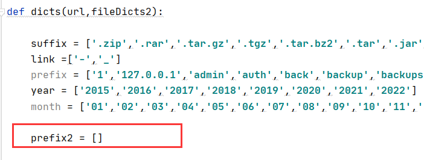

# 备份文件扫描器

## 简介

可以进行扫描，也可以只生成备份文件Fuzz字典`-n 1`

字典由两部分组成：

一部分是常规字典，初始已经生成`universal.txt`，字典由以下各段排列组合生成：

```
suffix = ['.zip','.rar','.tar.gz','.tgz','.tar.bz2','.tar','.jar','.war','.7z','.bak','.sql','.gz','.sql.gz','.tar.tgz']
link =['-','_']
prefix = ['1','127.0.0.1','admin','auth','back','backup','backups','bak','bin','code','database','data','users','db','dump','engine','error_log','test','htdocs','wz','files','home','html','index','local','localhost','master','new','old','orders','site','sql','store','beifen','wangzhan','web','website','temp','wp','www','wwwroot','root','log','temp']
year = ['2015','2016','2017','2018','2019','2020','2021','2022']
month = ['01','02','03','04','05','06','07','08','09','10','11','12']
```

另一部分是社工字典，通过解析url，将域名等关键字 加入到prefix2，然后再与suffix、year、month部分进行排列组合

```
例如http://www.baidu.com的解析结构：
prefix2 = ['baidu','baidu.com','www.baidu.com']
```

如果还有其他想加入的关键词，可以自行添加到prefix2列表中：




自动记录扫描成功的备份地址到指定的文件

```
例如 result.txt

https://www.baidu.com/baidu.tar.gz  size:1k
https://www.baidu.comn/www.baidu.com.zip  size:10M
```


## 使用

```
usage:
       Example: python3 BackUpFileScanner.py -t 10 -f url.txt -o result.txt
                python3 BackUpFileScanner.py -u https://www.example.com/ -o result.txt

A Website Backup File Leak Scan Tool.

optional arguments:
  -h, --help            show this help message and exit
  -f URL_FILE, --url-file URL_FILE
                        Example: url.txt
  -t [MAX_THREADS], --thread [MAX_THREADS]
                        how many threads? default 5
  -u [URL], --url [URL]
                        Example: http://www.example.com/anything
  -n N, --no-scan N     no scan,just generate dicts,default 0
  -o OUTPUT_FILE, --output-file OUTPUT_FILE
                        Example: result.txt
```

扫描单个网站：

```
python3 BackUpFileScanner.py -f url.txt -o result.txt
```

扫描多个网站：

```
python3 BackUpFileScanner.py -u https://www.example.com/ -o result.txt
```

不进行扫描，只生成备份文件Fuzz字典：

```
python3 BackUpFileScanner.py -u https://www.example.com/ -n 1
```

